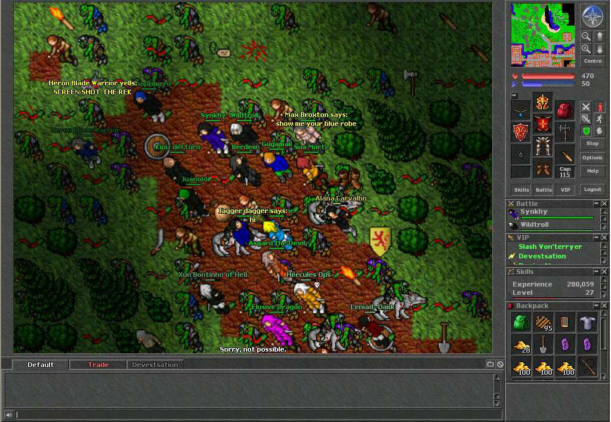
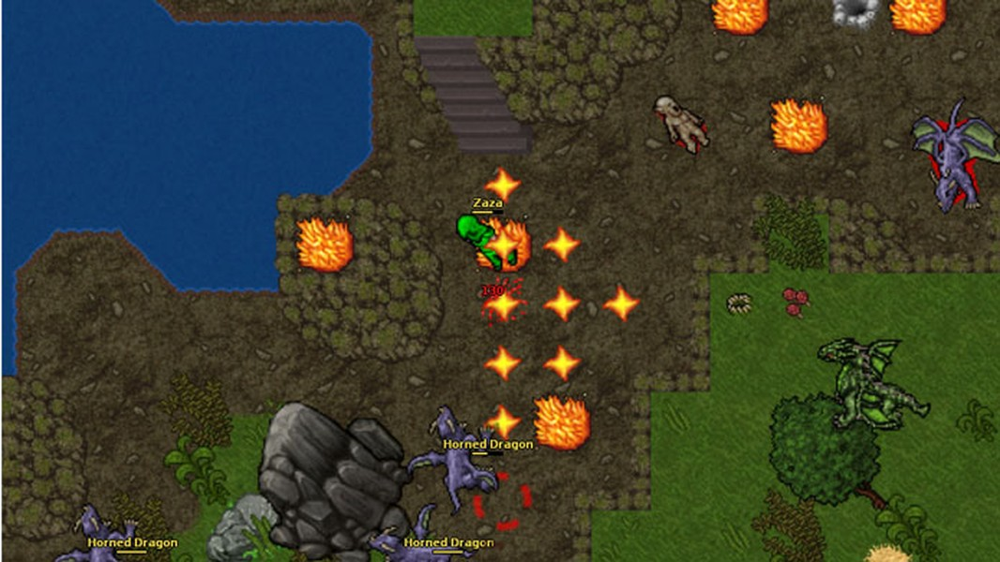

##
# **Phaser MMORPG**

_Brief Summary or Hook_

## Inspirações

**Estilo:** MMORPG

**Temática:** Medieval

**Plataforma(s):** PC / Mobile

## Descrição
Ainda não tenho uma ideia central de qual seria a história do jogo, mas o que eu tenho em mente por enquanto é que seria um MMORPG com poucas classes, tenho pensado em me inspirar bastante no Tibia, o jogador começa em uma zona pequena onde ele ira aprender os fundamentos básicos do jogo e ao atingir um certo nível e já decidido de qual classe ele sai dessa primeira zona pra ir de fato ao mundo do jogo.

