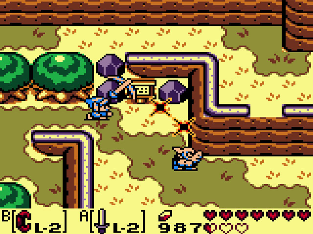

##
# **Concept Doc**

## Inspirações

**The legend of Zelda**

## Descrição

**Estilo:** MMORPG, Action RPG, Top-Down

**Temática:** Medieval

**Plataforma(s):** PC / Mobile

**Parte técnica:**

- Frontend: Phaser, ES6
- Backend: NodeJS, Express, Graphql
- Banco: MongoDB

## Introdução

Hero Journey é um jogo de action RPG top-down com exploração em um mundo livre, você pode matar monstros, se aventurar em dungeons, ter suas profissões, colecionar itens e ser um fazendeiro

[Voltar](../README.md)